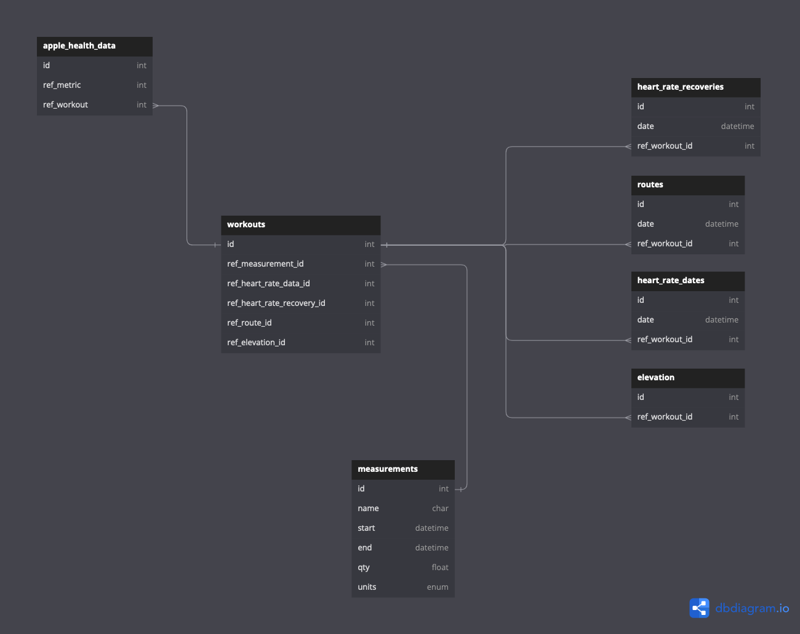

# self-sensored-io
WHERE I LEFT OFF:
1. Need to revise how much data is being loaded into a single Dynamo attribute cell.
2. Need to reshape the results to be confirmed by the requester.


# DynamoDB Rust Operations
https://docs.rs/aws-sdk-dynamodb/latest/aws_sdk_dynamodb/operation/index.html

# Run Command
```
AWS_PROFILE=personal TABLE=house_codex cargo lambda watch -a 127.0.0.1 -p 9001
```


## Impediments
```
Error: Unable to upload artifact PutFunction referenced by CodeUri parameter of PutFunction resource.
An HTTP Client raised an unhandled exception: sequence item 0: expected str instance, bytes found
```
Solved by:
https://github.com/aws/aws-sam-cli/issues/6667#issuecomment-1939435951
https://github.com/aws/aws-sam-cli/issues/6668

## Setting up SAM CLI on MacOS

The Python version finally worked for me.
https://docs.aws.amazon.com/serverless-application-model/latest/developerguide/manage-sam-cli-versions.html#manage-sam-cli-versions-install-virtual

## Error Propogation Issues


## Cargo Lambda
https://www.cargo-lambda.info/

## Multiple Endpoints
https://github.com/awslabs/aws-lambda-rust-runtime/issues/362
https://github.com/awslabs/aws-lambda-rust-runtime/issues/228
https://github.com/awslabs/aws-lambda-rust-runtime/issues/29#issuecomment-444421031

### With Axum
https://github.com/awslabs/aws-lambda-rust-runtime/blob/main/examples/http-axum-middleware/src/main.rs
https://github.com/tokio-rs/axum

## Serde DynamoDB
For easy recording of incoming items:
https://github.com/zenlist/serde_dynamo


## Auto Health Format
https://github.com/Lybron/health-auto-export/wiki/API-Export---JSON-Format

## Creating Rust Structs from JSON
https://github.com/Lybron/health-auto-export/wiki/API-Export---JSON-Format#json-format

# Data Schema


```
Table apple_health_data {
  id int
  ref_metric int
  ref_workout int [ref: > workouts.id ]
}

Table workouts {
  id int
  ref_measurement_id int [ref: > measurements.id]
  ref_heart_rate_data_id int
  ref_heart_rate_recovery_id int
  ref_route_id int
  ref_elevation_id int
}

Table measurements {
  id int
  name char
  start datetime
  end datetime
  qty float
  units enum
}

Table heart_rate_recoveries {
  id int
  date datetime
  ref_workout_id int [ref: > workouts.id]
  // ref_measurement_id int [ref: > measurements.id]
}

Table heart_rate_dates {
  id int
  date datetime
  ref_workout_id int [ref: > workouts.id]
  // ref_measurement_id int [ref: > measurements.id]
}

Table routes {
  id int
  date datetime
  ref_workout_id int [ref: > workouts.id]
  // ref_measurement_id int [ref: > measurements.id]
}

Table elevation {
  id int
  ref_workout_id int [ref: > workouts.id]
  // ref_measurement_id int [ref: > measurements.id] 
}
```